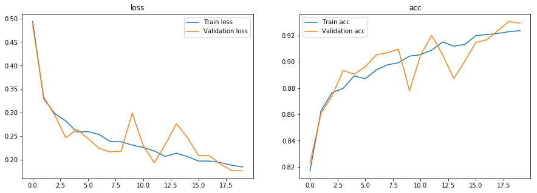
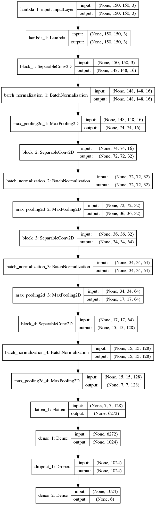

# Intel Image Classification Challenge 92%ACC With Keras/TensorFlow

# Project Overview
This data was initially published on https://datahack.analyticsvidhya.com by Intel to host a Image classification Challenge. Thanks to https://datahack.analyticsvidhya.com for the challenge and Intel for the Data. In this project I perform multi-class classifcation on different images from intels image classification competition. I use the deep learning library Keras with a TensorFlow backend and a custom build convolutional neural network. I used keras ImageDataGenerator to perform data augmentation on my images and used Keras callbacks to monitor training and visualize the training result in the kernel and TensorBoard. I was able to reach a 92% accuracy on this model!

# Kaggle Kernel/Dataset
Here is the link to my public kaggle kernel where I created this project. Within the kernel you can also find the output of the project in the "Output" tab and find the link and description to the dataset in the "Data" tab.

https://www.kaggle.com/twhitehurst3/intel-classification-keras-cnn-92-acc

  

# My pages
Kaggle: https://www.kaggle.com/twhitehurst3

GitHub: https://github.com/Terrance-Whitehurst

LinkedIn: https://www.linkedin.com/in/terrance-whitehurst-242423173/

Website: https://www.terrancewhitehurst.com/

# Happy Learning!

